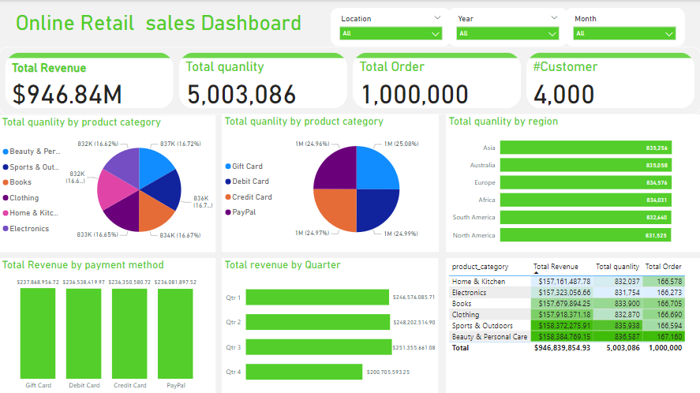
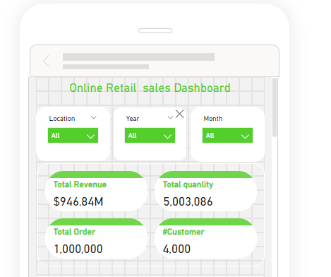
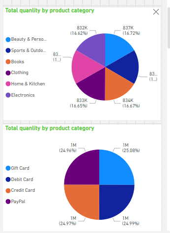
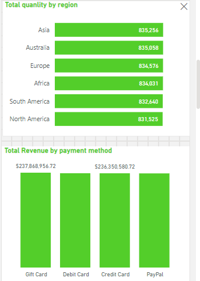
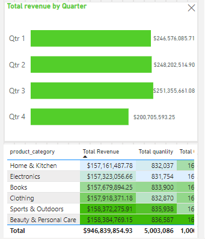

# Online Retail Sales Analyst Dashboard

## Features

- **Dynamic Filters:** Filter the data by location, year, and month for a more detailed view.
- **Sales Insights:** Analyze total revenue, quantity sold, total orders, and customer count.
- **Category and Region Analysis:** Visualize sales distribution by product category, payment method, and region.
- **Time-Based Analysis:** View revenue trends by quarter to identify seasonal patterns and peaks.
- **Mobile-Friendly View:** The dashboard is accessible on both desktop and mobile, providing a seamless experience across devices.

## Usage

1. **Filtering Data:** Use the filters at the top of the dashboard to view specific sales data by location, year, and month.
2. **Category Insights:** Review the pie charts and bar graphs to compare sales by product category and payment method.
3. **Time Analysis:** Analyze trends in sales by quarter to identify seasonal patterns or areas for improvement.
4. **Customer & Order Tracking:** Keep track of key metrics such as the total number of orders and customers in real-time.

## Data

The project was built using a simulated dataset for an online retail business. The dataset contains the following fields:
- **Revenue**: Total revenue generated from sales.
- **Quantity**: Number of products sold.
- **Orders**: Total orders placed by customers.
- **Customers**: Number of unique customers.
- **Product Category**: Category of products sold (e.g., Electronics, Clothing).
- **Payment Method**: Payment methods used (e.g., Credit Card, PayPal).
- **Location**: Regions where sales occurred (e.g., Asia, North America).
- **Date**: Year, quarter, and month of sales.
## Dashboard

